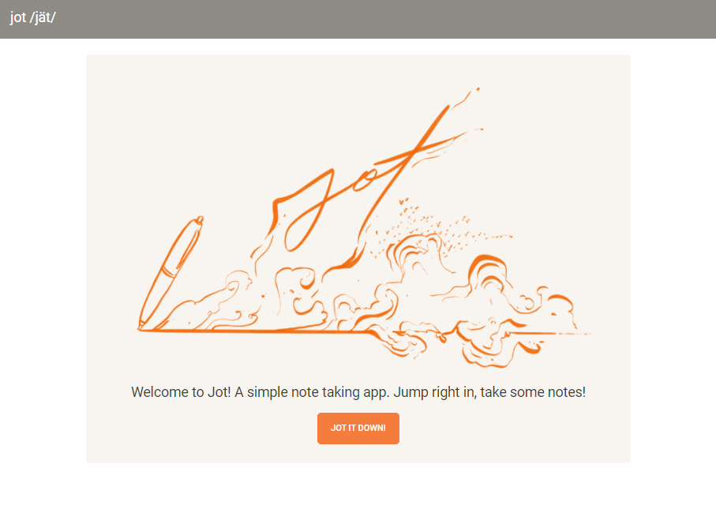
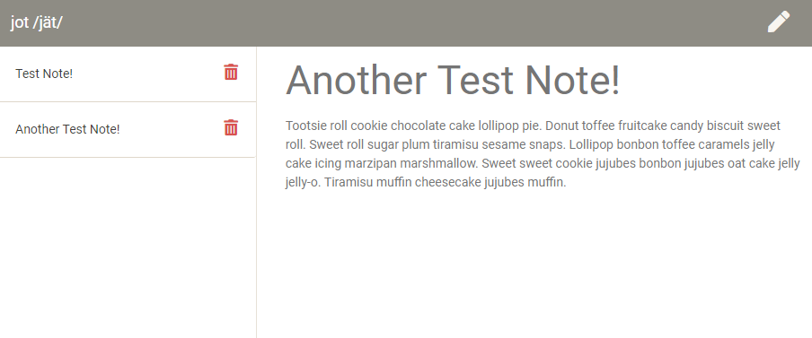

# Jot /jät/ it down!

Jot is a small application that allows you to write, save, and delete notes. It keeps perisistent notes, which makes the information available to you when needed.

## Table of Contents

* [Description](#description)
* [Usage](#usage)
* [Screenshots](#screenshots)
* [Questions](#questions)

## Description

* Link to the Heroku deployed application - [JOT /jät/](https://scary-mausoleum-13615.herokuapp.com/)
* Simple application powered by [Node.js](https://nodejs.org/en/)
* Consists of a `server.js` file, that leverages a folder named "public", which stores all of the assets for piecing together the application. The "db" folder contains a JSON file that retains all of the notes.
* Utilizes the [Express package](https://www.npmjs.com/package/express) and the [UUID package](https://www.npmjs.com/package/uuid)
* Logo was illustrated by `BERTO` (www.robertorubet.com)

## Usage

The application is fairly straightforward. You are greeted with a splash screen, which then leads you into the note taker. You must enter a `title` and enter `text` into the body of the note. A `save` icon will appear in the upper right corner. Click on it and your note will be saved to the left side-bar. You can save multiple notes, which the application will retain. Selecting a created note, will present the data in the viewing area. If you wish to enter a new note, simply select the `pencil` icon in the upper right corner. If you wish to delete and entry, you simply click on the small `garbage can` icon next to the enrty, in the left side-bar.

## Screenshots

Screenshot of the Welcome page

Screenshot of the Note Taker

## Questions

Feel free to get in touch with me if you have any questions or concerns.

Link to my GitHub Profile: [Bertodemus](https://github.com/bertodemus)

Email me at: [roberto@robertorubet.com](roberto@robertorubet.com)

